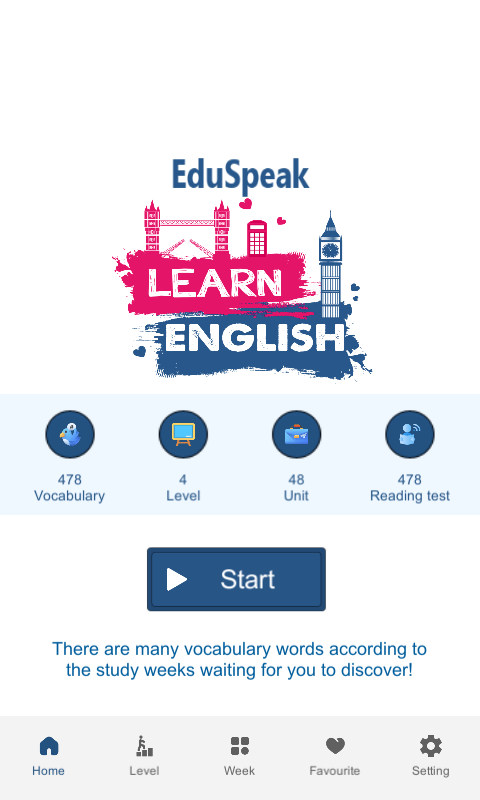
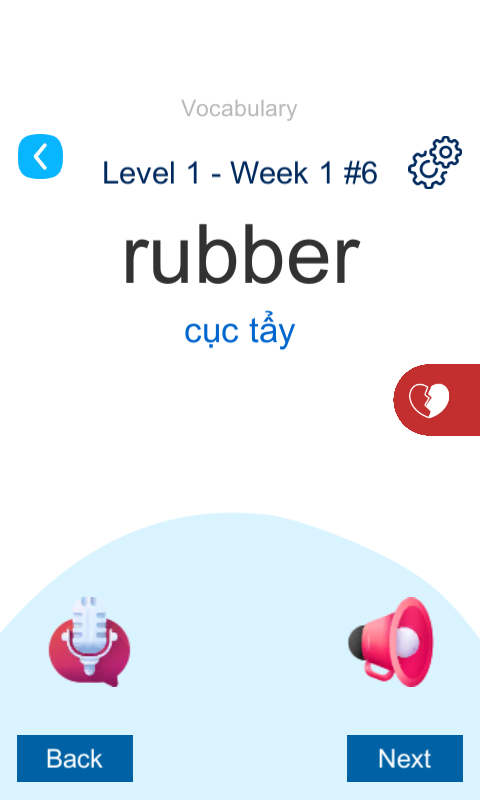
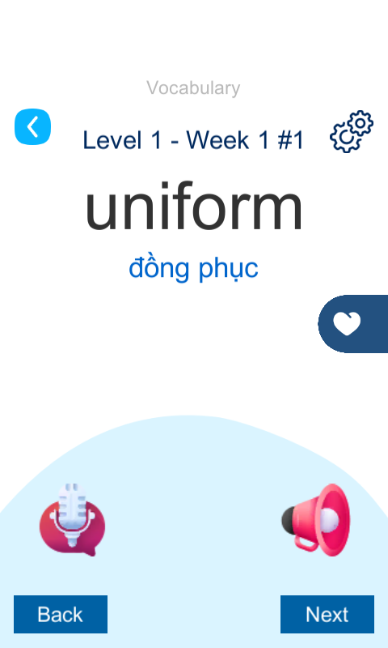

# EduSpeak
EduSpeak is an innovative and user-friendly app designed specifically for middle school students to enhance their English pronunciation and listening skills. With engaging exercises, real-time feedback, and interactive lessons, EduSpeak helps students improve their spoken English and develop confidence in communicating.

